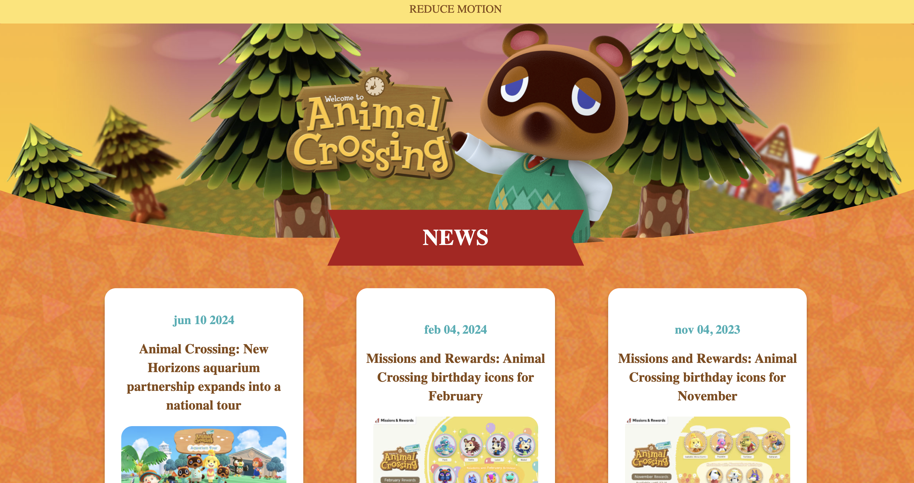

# Procesverslag
Markdown is een simpele manier om HTML te schrijven.  
Markdown cheat cheet: [Hulp bij het schrijven van Markdown](https://github.com/adam-p/markdown-here/wiki/Markdown-Cheatsheet).

Nb. De standaardstructuur en de spartaanse opmaak van de README.md zijn helemaal prima. Het gaat om de inhoud van je procesverslag. Besteedt de tijd voor pracht en praal aan je website.

Nb. Door *open* toe te voegen aan een *details* element kun je deze standaard open zetten. Fijn om dat steeds voor de relevante stuk(ken) te doen.

## Jij

  
uitwerken voor kick-off werkgroep

  ### Auteur:
  Keira Jol

  #### Je startniveau:
  Rood

  #### Je focus:
  Surface plane

  #### github link:
  https://github.com/keirajol/Animal-crossing.git
 

## Je website

  
uitwerken voor kick-off werkgroep

  ### Je opdracht:
  https://animalcrossing.nintendo.com/

  #### Screenshot(s) van de eerste pagina (small screen): 
  Home pagina 

  

  #### Screenshot(s) van de tweede pagina (small screen):
  Nieuws pagina  
  
 

## Toegankelijkheidstest 1/2 (week 1)

  
uitwerken na test in 2e werkgroep

  ### Bevindingen
  Lijst met je bevindingen die in de test naar voren kwamen:
  - Tekst contrast niet overal voldoende (bijvoorbeeld witte tekst op een lichte achtergrond).
  - Niet elke afbeelding heeft een alt tekst.
  - Volgorde van klikken is niet altijd logisch.
  

## Breakdownschets (week 1)

  
uitwerken na afloop 3e werkgroep

  ### de hele pagina: 
  

## Voortgang 1 (week 2)

  
uitwerken voor 1e voortgang

      

  ### Stand van zaken
  hier dit ging goed & dit was lastig (neem ook screenshots op van delen van je website en code)
  Ik was eerst bezig met de html dat kon ik best goed al indelen. Opzich ging alles wel goed maar ik had nog wel moeite met css selectors. Waardoor ik css code aan het schrijven was maar het werkte niet omdat de selector niet correct was.

  ### Verslag van meeting
  hier na afloop snel de uitkomsten van de meeting vastleggen

  - Ik had nog niet zoveel vragen. Ik was al erg goed opweg hier en had al het begin van de eerste pagina. 

## Voortgang 2 (week 3)

  
uitwerken voor 2e voortgang

  ### Stand van zaken
  hier dit ging goed & dit was lastig (neem ook screenshots op van delen van je website en code)
  Ik was al best ver met de Home pagina. Ik had een paar problemen waar ik zelf niet uit kom. ik wou namelijk dat een section een rode einde had maar dat krijg ik niet voor elkaar. 
  Ik krijg bij section 1 in de main waar de kado img instaat krijg ik de button niet volledig rond.

  ### Verslag van meeting
  hier na afloop snel de uitkomsten van de meeting vastleggen

  - Problem: Ronde einde voor een section.
  Ik ben geholpen door de studentassisten.
  oplossing:
  Ik moest gebruik maken van clip path alleen als ik dat gebruikte werd de section erg klein. Waardoor ik een div heb gebruikt en daarop heb ik een clip path gemaakt.

  css code:
  main>div:nth-of-type(3) {
    position: relative;
    clip-path: ellipse(65% 60% at 52% 100%);
    background-image: url(Images/green-triangles.png);
    background-color: #01A623;
    height: 20em;
    margin-top: 5em;
}

- Problem: Een button een volledig rondje maken
Oplossing: aspect-ratio: 1;

## Toegankelijkheidstest 2/2 (week 4)

  
uitwerken na test in 9e werkgroep

  
  ### Bevindingen
  Lijst met je bevindingen die in de test naar voren kwamen (geef ook aan wat er verbeterd is):
  - de Headings stonden nog niet allemaal goed heb ik aangepast.
  - contrast bij de hover van een button was slecht tekst was erg onduidelijk.
  - Geen duidelijke alt teksten. 
  - Bij voice over skipte het soms een link.
  - 

## Voortgang 3 (week 4)

  
uitwerken voor 3e voortgang

  

  ### Stand van zaken
  hier dit ging goed & dit was lastig (neem ook screenshots op van delen van je website en code)
  Ik ben al klaar met de website alleen moet het nog toegankelijk gemaakt worden. Een probleem die ik heb is dat ik via een bron een button in een a heb gezet waardoor het met een screenreader er 2 keer overheen ging. Ook zijn de headings nog in de juiste volgorde.

  ### Verslag van meeting
  hier na afloop snel de uitkomsten van de meeting vastleggen

  - Problem: button in een a is niet toegankelijk.
  Oplossing:
  geen button gebruiken maar de a stijlen als een button.
  - problem: datums niet in een een heading maar in een time.

  - Bij de amiibo in een list zetten en niet naast elkaar stijlen.

## Eindgesprek (week 5)

  
uitwerken voor eindgesprek

  ### Je uitkomst - karakteristiek screenshots:

  
  
  
  
  

  ### Dit ging goed/Heb ik geleerd: 
  - Navigatie volgorde aanpassen: De tab-volgorde was niet altijd logisch en het duurde even voordat ik dat goed had.
  - De css selectors, ik gebruikte vooral classes en ids af en toe wel selectors maar ik gebruikte best snel een class waardoor ik nog niet zo goed de selectors kenden. Ik dit bij deze opdracht veel ontwikkeld en snap nu hoe de css selectors werken.

  

  ### Dit was lastig/Is niet gelukt:
  Korte omschrijving met plaatjes
  - Navigatie volgorde aanpassen: De tab-volgorde was niet altijd logisch en het duurde even voordat ik dat goed had.

  - ik vond de ronde onderkant krijgen erg lastig en heb ik best veel moeite mee gehad om het goed te krijgen.

  

## Bronnenlijst

  
continu bijhouden terwijl je werkt

  Nb. Wees specifiek ('css-tricks' als bron is bijv. niet specifiek genoeg). 
  Nb. ChatGpT en andere AI horen er ook bij.
  Nb. Vermeld de bronnen ook in je code.

1. Complete Guide to Grid - CSS Tricks- https://css-tricks.com/snippets/css/complete-guide-grid/
Gebruikt voor het structureren van de lay-out met CSS Grid.

2. Clippy - CSS clip-path maker- https://bennettfeely.com/clippy/
Gebruikt om clip-path-vormen te genereren voor specifieke secties.

3. W3C Web Accessibility Initiative- https://www.w3.org/WAI/test-evaluate/
Gebruikt voor het uitvoeren van toegankelijkheidstesten en controleren van de toegankelijkheidsnormen.

4. MDN Web Docs - ARIA labels- https://developer.mozilla.org/en-US/docs/Web/Accessibility/ARIA
Gebruikt voor het implementeren van ARIA-labels voor toegankelijkheid.

5. W3Schools - CSS Tutorial- https://www.w3schools.com/css/default.asp
Gebruikt voor meerdere css elementen.

## Eindgesprek punten
- Bij het eindgesprek hebben we besproken dat de javascript code nog mist en ik nog een beetje javascript moet toevoegen voor de herkansing. Hiermee moest ik een micro interactie maken. We hebben tijdens het gesprek een besproken hoe javascript een beetje werkt en hoe ik het kan toepassen. 
- Ook waren de headings levels niet helemaal goed geplaatst en kan dit ook verbeterd worden. 

### wat ga ik toevoegen:
- Ik heb met javascript ervoor gezorgd dat wanneer je op de charlotte img klikt in het begint, dat er dan een tekst ballon te voorschijn komt met de tekst 'Hello i'm Charlotte'. Ik vond dit wel een leuke toevoeging voor de website. 

Hier had ik eerst een beetje moeite mee want het lukte niet helemaal. Ik heb daarom een test bestand aangemaakt om het te testen op een simpelere manier. Waardoor het makkelijker werd bij de echt website. Door dit eerst te testen kreeg ik meer een idee hoe ik dit kon toepassen bij mijn website. Hierdoor is het ook gelukt om het toetevoegen. 

- De heading levels veranderen was eigenlijk erg makkelijk. Want het moest op de volgorde van 1 t/m 10 bijv. Je mag ook geen headinglevel overslaan. Dit heb ik aangepast.

  
  
  
   

